# Layers

OSI (Open Systems Interconnection) Model:

*   **_Physical layer_**
*   **_Data layer_**
*   **_Network layer_**
*   **_Transport layer_**
*   **Session layer:**

    Allows users to establish session between them.

    *   dialog control: whose turn is to transmit
    *   token management: preventing two parties from attempting the same crucial operation simultaneously
    *   synchronization: checkpointing long transmission to pick up from where they left up off in the event of a crash and subsequent recovery

* **Presentation layer**: Presentation layer is concerned with syntax and
  semantics of the information transmitted. 
* **_Application layer_**

TCP/IP (Transmission Control Protocol/ Internet Protocol) Reference Model:

*   Link layer (== Data Link layer)
*   Internet layer (== Network layer of OSI)
*   Transport layer 
*   Application layer (= Session + Presentation + Application layer of OSI)

Structure followed in Kurose & Ross, E6 book (_top-down approach_):

*   Application layer
*   Transport layer
*   Network layer
*   Data link layer
*   Physical layer

# Application Layer

## Transport Services Available to Applications

*   Reliable Data Transfer
*   Throughput
*   Timing
*   Security

## TCP Services

- **Connection-oriented Services**: TCP has the client and server exchange
  transport layer control information with each other before the application-level
  messages begin to flow. This so-called handshaking procedure alerts the client
  and server, allowing them to prepare for an onslaught of packets. After the
  handshaking phase, a TCP connection is said to exist between the sockets of the
  two processes. The connection is a full-duplex connection in that the two processes
  can send messages to each other over the connection at the same time. When the
  application finishes sending messages, it must tear down the connection.
- **Reliable data transfer service**: The communicating processes can rely on
  TCP to deliver all data sent without error and in the proper order. When one side
  of the application passes a stream of bytes into a socket, it can count on TCP
  to deliver the same stream of bytes to the receiving socket, with no missing or
  duplicate bytes.

TCP also includes a congestion-control mechanism.

## UDP Services

UDP is a no-frills, lightweight transport protocol, providing minimal services.
UDP is connectionless, so there is no handshaking before the two processes start
to communicate. UDP provides an unreliable data transfer service—that is, when a
process sends a message into a UDP socket, UDP provides no guarantee that the message
will ever reach the receiving process. Furthermore, messages that do arrive at the
receiving process may arrive out of order. UDP does not include a congestion-control
mechanism, so the sending side of UDP can pump data into the layer below (the network
layer) at any rate it pleases. (Note, however, that the actual end-to-end throughput
may be less than this rate due to the limited transmission capacity of intervening
links or due to congestion).


## HTTP (HyperText Transfer Protocol)

**_[Hypertext Transfer Protocol (HTTP)](https://www.geeksforgeeks.org/http-non-persistent-persistent-connection/): is an application-level protocol that uses TCP as an underlying transport and typically runs on port 80. HTTP is a stateless protocol i.e. server maintains no information about past client requests._**

It is important to note that the server sends requested files to clients without
storing any state information about the client. If a particular client asks for
the same object twice in a period of a few seconds, the server does not respond
by saying that it just served the object to the client; instead, the server resends
the object, as it has completely forgotten what it did earlier. Because an HTTP
server maintains no information about the clients, HTTP is said to be a stateless
protocol. We also remark that the Web uses the client-server application architecture.
A Web server is always on, with a fixed IP address, and it services requests from
potentially millions of different browsers.


### HTTP Message Format

HTTP Request Message


```text
GET /somedir/page.html HTTP/1.1
Host: www.someschool.edu
Connection: close
User-agent: Mozilla/5.0
Accept-language: fr
```

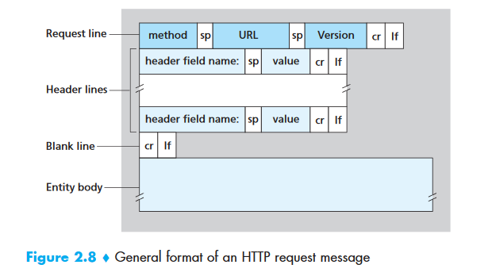


                                Source: Page-105; Kurose & Ross, E6


### HTTP Response Message


```text
HTTP/1.1 200 OK
Connection: close
Date: Tue, 09 Aug 2011 15:44:04 GMT
Server: Apache/2.2.3 (CentOS)
Last-Modified: Tue, 09 Aug 2011 15:11:03 GMT
Content-Length: 6821
Content-Type: text/html

(data data data data data ...)
```


### Common HTTP Status Codes 

**200 OK**: Request succeeded and the information is returned in the response.

**301 Moved Permanently**: Requested object has been permanently moved; the new URL
is specified in `Location:` header of the response message. The client software
will automatically retrieve the new URL.

**400 Bad Request**: This is a generic error code indicating that the request could
not be understood by the server.

**404 Not Found**: The requested document does not exist on this server.

**505 HTTP Version Not Supported**: The requested HTTP protocol version is not
supported by the server.


## File Transfer Protocol (FTP)

**_[File Transfer Protocol (FTP)](https://www.geeksforgeeks.org/computer-network-file-transfer-protocol-ftp/)
: File Transfer Protocol(FTP) is an application layer protocol which moves files
between local and remote file systems. It runs on top of TCP, like HTTP. To transfer
a file, 2 TCP connections are used by FTP in parallel: control connection and data
connection._**


FTP uses two parallel connections to transfer a file:

- control connection
- data connection


The control connection is used for sending control information between the two
hosts—information such as user identification, password, commands to change remote
directory, and commands to “put” and “get” files.

The data connection is used to actually send a file.

Because FTP uses a separate control connection, FTP is said to send its control
information **out-of-band**. HTTP sends request and response header lines into the
same TCP connection that carries the transferred file itself. For this reason,
HTTP is said to send its control information **in-band**. SMTP, the main protocol
for electronic mail, also sends control information **in-band**.

When a user starts an FTP session with a remote host, the client side of FTP (user) first initiates a control TCP connection with the server side (remote host) on server port number 21. The client side of FTP sends the user identification and password over this control connection. The client side of FTP also sends, over the control connection, commands to change the remote directory. When the server side receives a command for a file transfer over the control connection (either to, or from, the remote host), the server side initiates a TCP data connection to the client side. FTP sends exactly one file over the data connection and then closes the data connection. If, during the same session, the user wants to transfer another file, FTP opens another data connection. Thus, with FTP, the control connection remains open throughout the duration of the user session, but a new data connection is created for each file transferred within a session (that is, the data-connection is non-persistent).

Throughout a session, the FTP server must maintain state about the user. In particular, the server must associate the control connection with a specific user account, and the server must keep track of the user’s current directory as the user wanders about the remote directory tree. Keeping track of this state information for each ongoing user session significantly constrains the total number of sessions that FTP can maintain simultaneously. Recall that HTTP, on the other hand, is stateless—it does not have to keep track of any user state.


### FTP Commands and Replies

`USER username`: Used to send the user identification to the server.

`PASS password`: Used to send the user password to the server.

`LIST`: Used to ask the server to send back a list of all the files in the current remote directory. The list of files is sent over a (new and non-persistent) data connection rather than the control TCP connection.

`RETR filename`: Used to retrieve (that is, get) a file from the current directory of the remote host. This command causes the remote host to initiate a data connection and to send the requested file over the data connection.

`STOR filename`: Used to store (that is, put) a file into the current directory of the remote host.


```text
• 331 Username OK, password required
• 125 Data connection already open; transfer starting
• 425 Can't open data connection
• 452 Error writing file
```


## Simple Mail Transfer Protocol (SMTP)

**_[Simple Mail Transfer Protocol (SMTP)](https://www.geeksforgeeks.org/simple-mail-transfer-protocol-smtp/): SMTP is an application layer protocol. The client who wants to send the mail opens a TCP connection to the SMTP server and then sends the mail across the connection. The SMTP server is always on listening mode. As soon as it listens for a TCP connection from any client, the SMTP process initiates a connection on that port (25). After successfully establishing the TCP connection the client process sends the mail instantly._**


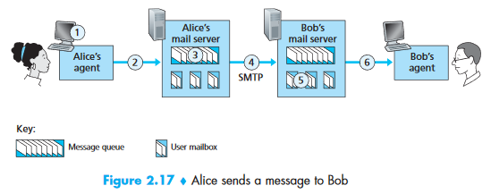


Suppose Alice wants to send Bob a simple message:


1. Alice invokes her user agent for e-mail, provides Bob’s e-mail address (for example, bob@someschool.edu), composes a message, and instructs the user agent to send the message.
2. Alice’s user agent sends the message to her mail server, where it is placed in a message queue.
3. The client side of SMTP, running on Alice’s mail server, sees the message in the message queue. It opens a TCP connection to an SMTP server, running on Bob’s mail server.
4. After some initial SMTP handshaking, the SMTP client sends Alice’s message into the TCP connection.
5. At Bob’s mail server, the server side of SMTP receives the message. Bob’s mail server then places the message in Bob’s mailbox.
6. Bob invokes his user agent to read the message at his convenience.

SMTP does not generally use intermediate mail servers.

SMTP uses persistent connection.

### HTTP vs SMTP

First, HTTP is mainly a **pull protocol**—someone loads information on a Web server and users use HTTP to pull the information from the server at their convenience. In particular, the TCP connection is initiated by the machine that wants to receive the file. On the other hand, SMTP is primarily a **push protocol**—the sending mail server pushes the file to the receiving mail server. In particular, the TCP connection is initiated by the machine that wants to send the file.

A second difference, which we alluded to earlier, is that SMTP requires each message, including the body of each message, to be in 7-bit ASCII format. If the message contains characters that are not 7-bit ASCII (for example, French characters with accents) or contains binary data (such as an image file), then the message has to be encoded into 7-bit ASCII. HTTP data does not impose this restriction.

A third important difference concerns how a document consisting of text and images (along with possibly other media types) is handled. HTTP encapsulates each object in its own HTTP response message. Internet mail places all of the message’s objects into **one message**.


### Mail Access Protocols


#### POP3 (Post Office Protocol - Version 3)

POP3 is an extremely simple mail access protocol. It is defined in [RFC 1939], which is short and quite readable. Because the protocol is so simple, its functionality is rather limited. POP3 begins when the user agent (the client) opens a TCP connection to the mail server (the server) on port 110. With the TCP connection established, POP3 progresses through three phases: authorization, transaction, and update. During the first phase, authorization, the user agent sends a username and a password (in the clear) to authenticate the user. During the second phase, transaction, the user agent retrieves messages; also during this phase, the user agent can mark messages for deletion, remove deletion marks, and obtain mail statistics. The third phase, update, occurs after the client has issued the quit command, ending the POP3 session; at this time, the mail server deletes the messages that were marked for deletion.

In a POP3 transaction, the user agent issues commands, and the server responds to each command with a reply. There are two possible responses: +OK (sometimes followed by server-to-client data), used by the server to indicate that the previous command was fine; and -ERR, used by the server to indicate that something was wrong with the previous command.


#### Internet Mail Access Protocol (IMAP)

An IMAP server will associate each message with a folder; when a message first arrives at the server, it is associated with the recipient’s INBOX folder. The recipient can then move the message into a new, user-created folder, read the message, delete the message, and so on. The IMAP protocol provides commands to allow users to create folders and move messages from one folder to another. IMAP also provides commands that allow users to search remote folders for messages matching specific criteria. Note that, unlike POP3, an IMAP server maintains user state information across IMAP sessions—for example, the names of the folders and which messages are associated with which folders.

Another important feature of IMAP is that it has commands that permit a user agent to obtain components of messages. For example, a user agent can obtain just the message header of a message or just one part of a multipart MIME message. This feature is useful when there is a low-bandwidth connection (for example, a slow-speed modem link) between the user agent and its mail server. With a low-bandwidth connection, the user may not want to download all of the messages in its mailbox, particularly avoiding long messages that might contain, for example, an audio or video clip.


#### Web-based E-Mail

With this service, the user agent is an ordinary Web browser, and the user communicates with its remote mailbox via HTTP. When a recipient, such as Bob, wants to access a message in his mailbox, the e-mail message is sent from Bob’s mail server to Bob’s browser using the HTTP protocol rather than the POP3 or IMAP protocol. When a sender, such as Alice, wants to send an e-mail message, the e-mail message is sent from her browser to her mail server over HTTP rather than over SMTP. Alice’s mail server, however, still sends messages to, and receives messages from, other mail servers using SMTP.


## Domain Name System (DNS)

_DNS is a host name to IP address translation service. DNS is a distributed database
implemented in a hierarchy of name servers. It is an application layer protocol for
message exchange between clients and servers._

### DNS Services

- Translating host name to IP addresses
- **Host aliasing**: A host with a complicated hostname can have one or more alias names. For example, a hostname such as relay1.west-coast.enterprise.com could have, say, two aliases such as enterprise.com and www.enterprise.com. In this case, the hostname relay1.westcoast.enterprise.com is said to be a canonical hostname.
- **Mail server aliasing**: For obvious reasons, it is highly desirable that e-mail addresses be mnemonic. For example, if Bob has an account with Hotmail, Bob’s e-mail address might be as simple as bob@hotmail.com. However, the hostname of the Hotmail mail server is more complicated and much less mnemonic than simply hotmail.com (for example, the canonical hostname might be something like relay1.west-coast.hotmail.com). DNS can be invoked by a mail application to obtain the canonical hostname for a supplied alias hostname as well as the IP address of the host. In fact, the MX record permits a company’s mail server and Web server to have identical (aliased) hostnames; for example, a company’s Web server and mail server can both be called enterprise.com.
- **Load distribution**: DNS is also used to perform load distribution among replicated servers, such as replicated Web servers. Busy sites, such as cnn.com, are replicated over multiple servers, with each server running on a different end system and each having a different IP address. For replicated Web servers, a set of IP addresses is thus associated with one canonical hostname. The DNS database contains this set of IP addresses. When clients make a DNS query for a name mapped to a set of addresses, the server responds with the entire set of IP addresses, but rotates the ordering of the addresses within each reply. Because a client typically sends its HTTP request message to the IP address that is listed first in the set, DNS rotation distributes the traffic among the replicated servers.

    DNS rotation is also used for e-mail so that multiple mail servers can have the same alias name. Also, content distribution companies such as Akamai have used DNS in more sophisticated ways [Dilley 2002] to provide Web content distribution (see Chapter 7).


### Overview of How DNS Works

Suppose that some application (such as a Web browser or a mail reader) running
in a user’s host needs to translate a hostname to an IP address. The application
will invoke the client side of DNS, specifying the hostname that needs to be translated.
(On many UNIX-based machines, gethostbyname() is the function call that an application
calls in order to perform the translation.) DNS in the user’s host then takes over,
sending a query message into the network. **All DNS query and reply messages are
sent within UDP datagrams to port 53**. After a delay, ranging from milliseconds
to seconds, DNS in the user’s host receives a DNS reply message that provides the
desired mapping. This mapping is then passed to the invoking application. Thus,
from the perspective of the invoking application in the user’s host, DNS is a
black box providing a simple, straightforward translation service. But in fact,
the black box that implements the service is complex, consisting of a large
number of DNS servers distributed around the globe, as well as an application-layer
protocol that specifies how the DNS servers and querying hosts communicate.


## Peer-to-Peer Applications

P2P File Distribution

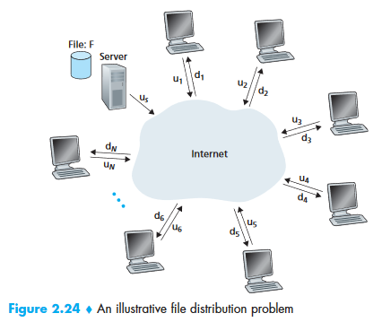


Minimum distribution time:


### BitTorrent

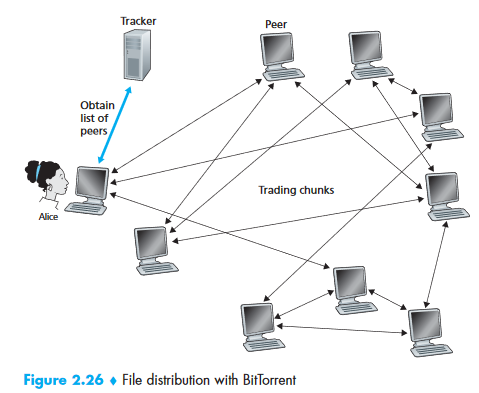


**Decisions**:

_First, which chunks should she request first from her neighbors?_

In deciding which chunks to request, Alice uses a technique called rarest first. The idea is to determine, from among the chunks she does not have, the chunks that are the rarest among her neighbors (that is, the chunks that have the fewest repeated copies among her neighbors) and then request those rarest chunks first. In this manner, the rarest chunks get more quickly redistributed, aiming to (roughly) equalize the numbers of copies of each chunk in the torrent.

_Second, to which of her neighbors should she send requested chunks?_

To determine which requests she responds to, BitTorrent uses a clever trading algorithm. The basic idea is that Alice gives priority to the neighbors that are currently supplying her data at the highest rate. Specifically, for each of her neighbors, Alice continually measures the rate at which she receives bits and determines the four peers that are feeding her bits at the highest rate. She then reciprocates by sending chunks to these same four peers. Every 10 seconds, she recalculates the rates and possibly modifies the set of four peers. In BitTorrent lingo, these four peers are said to be **unchoked**. Importantly, every 30 seconds, she also picks one additional neighbor at random and sends it chunks. Let’s call the randomly chosen peer Bob. In BitTorrent lingo, Bob is said to be **optimistically unchoked**. <span style="text-decoration:underline;">Because Alice is sending data to Bob, she may become one of Bob’s top four uploaders, in which case Bob would start to send data to Alice</span>. <span style="text-decoration:underline;">If the rate at which Bob sends data to Alice is high enough, Bob could then, in turn, become one of Alice’s top four uploaders</span>. In other words, every 30 seconds, Alice will randomly choose a new trading partner and initiate trading with that partner. If the two peers are satisfied with the trading, they will put each other in their top four lists and continue trading with each other until one of the peers finds a better partner. The effect is that peers capable of uploading at compatible rates tend to find each other. The random neighbor selection also allows new peers to get chunks, so that they can have something to trade. All other neighboring peers besides these five peers (four “top” peers and one probing peer) are “choked,” that is, they do not receive any chunks from Alice. BitTorrent has a number of interesting mechanisms that are not discussed here, including pieces (mini-chunks), pipelining, random first selection, endgame mode, and anti-snubbing

The incentive mechanism for trading just described is often referred to as tit-for-tat.


### Distributed Hash-Tables (DHT)

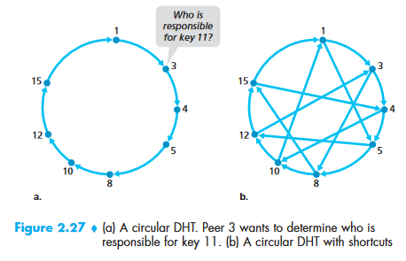


## Socket Programming [KuroseRoss]


## Protocols (Recap)

**[Dynamic Host Configuration Protocol(DHCP)](https://www.geeksforgeeks.org/computer-network-dynamic-host-configuration-protocol-dhcp/)** is an application layer protocol which is used to provide:

Subnet Mask (Option 1 – e.g., 255.255.255.0)

Router Address (Option 3 – e.g., 192.168.1.1)

DNS Address (Option 6 – e.g., 8.8.8.8)

Vendor Class Identifier (Option 43 – e.g., ‘unifi’ = 192.168.1.9 ##where unifi = controller)

**[Simple Network Management Protocol (SNMP)](https://www.geeksforgeeks.org/computer-network-simple-network-management-protocol-snmp/): SNMP is an application layer protocol which uses UDP port number 161/162. SNMP is used to monitor network, detect network faults and sometimes even used to configure remote devices.

**Hypertext Transfer Protocol Secure (HTTPS)**: Cryptographic protocols such as SSL and/or TLS turn _http_ into _https_ i.e. **https** = **http** + **cryptographic protocols**. Also, to achieve this security in _https_, Public Key Infrastructure (PKI) is used because public keys can be used by several Web Browsers while private key can be used by the Web Server of that particular website. The distribution of these public keys is done via Certificates which are maintained by the Browser. You can check these certificates in your Browser settings. Uses port 443.


## UDP Protocols

UDP Header


1. **Source Port :** Source Port is 2 Byte long field used to identify port number of source.
2. **Destination Port :** It is 2 Byte long field, used to identify the port of destined packet.
3. **Length :** Length is the length of UDP including header and the data. It is 16-bits field.
4. **Checksum :** Checksum is 2 Bytes long field. It is the 16-bit one’s complement of the one’s complement sum of the UDP header, pseudo header of information from the IP header and the data, padded with zero octets at the end (if necessary) to make a multiple of two octets.

**Notes –** Unlike TCP, Checksum calculation is not mandatory in UDP. No Error control or flow control is provided by UDP. Hence UDP depends on IP and ICMP for error reporting.


*   Following implementation uses UDP as a transport layer protocol:
    *   NTP (Network Time Protocol)
    *   DNS (Domain Name Service)
    *   BOOTP, DHCP.
    *   NNP (Network News Protocol)
    *   Quote of the day protocol
    *   TFTP, RTSP, RIP, OSPF.

**When to use UDP?**

*   Reduce the requirement of computer resources.
*   When using the Multicast or Broadcast to transfer.
*   The transmission of Real-time packets, mainly in multimedia applications.

**NTP (Network Time Protocol)**: The _Network Time Protocol_ (_NTP_) is used to synchronize the time of a computer client or server to another server or reference time source.

RARP

BOOTP

DHCP

Read Protocols from Tanenbaum P465


# Transport Layer

_Source: P185-285 KuroseRossE6_

It has the critical role of providing communication services directly to the application processes running on different hosts.


## Transport Layer Services

A transport-layer protocol provides for** logical communication** between application processes running on different hosts. By _logical communication_, we mean that from an application’s perspective, it is as if the hosts running the processes were directly connected; in reality, the hosts may be on opposite sides of the planet, connected via numerous routers and a wide range of link types. Application processes use the logical communication provided by the transport layer to send messages to each other, free from the worry of the details of the physical infrastructure used to carry these messages. Figure 3.1 illustrates the notion of logical communication.

It may be noted that the transport layer is not implemented in the intermediate network routers, rather implemented in the end systems.


## Relationship Between Transport and Network Layers

application messages = letters in envelopes

processes = cousins

hosts (also called end systems) = houses

transport-layer protocol = Ann and Bill

network-layer protocol = postal service (including mail carriers)


## Overview

UDP (User Datagram Protocol): provides an unreliable, connectionless service to the invoking application

TCP (Transmission Control Protocol): provides a reliable, connection-oriented service to the invoking application

To simplify terminology, when in an Internet context, we refer to the transport layer packet as a segment. We mention, however, that the Internet literature (for example, the RFCs) also refers to the transport-layer packet for TCP as a segment but often refers to the packet for UDP as a datagram. But this same Internet literature also uses the term datagram for the network-layer packet! _For an introductory book on computer networking such as this, we believe that it is less confusing to refer to both TCP and UDP packets as segments, and reserve the term datagram for the network-layer packet._

_204_


## Multiplexing and Demultiplexing

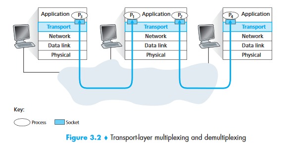


The job of delivering the data in a transport-layer segment to the correct socket is called **demultiplexing**.

The job of gathering data chunks at the source host from different sockets, encapsulating each data chunk with header information (that will later be used in demultiplexing) to create segments, and passing the segments to the network layer is called **multiplexing**.

Transport-layer multiplexing requires (1) that sockets have unique identifiers, and (2) that each segment have special fields that indicate the socket to which the segment is to be delivered. These special fields, illustrated in Figure 3.3, are the source port number field and the destination port number field. (The UDP and TCP segments have other fields as well, as discussed in the subsequent sections of this chapter.) Each port number is a 16-bit number, ranging from 0 to 65535. The port numbers ranging from 0 to 1023 are called **well-known port numbers** and are restricted, which means that they are reserved for use by well-known application protocols such as HTTP (which uses port number 80) and FTP (which uses port number 21). 

_What happens if there are two FTP processes running?_

[https://stackoverflow.com/questions/3329641/how-do-multiple-clients-connect-simultaneously-to-one-port-say-80-on-a-server](https://stackoverflow.com/questions/3329641/how-do-multiple-clients-connect-simultaneously-to-one-port-say-80-on-a-server)

[https://superuser.com/questions/1267192/multiple-processes-listening-on-the-same-port-how-is-it-possible](https://superuser.com/questions/1267192/multiple-processes-listening-on-the-same-port-how-is-it-possible) [https://stackoverflow.com/questions/1694144/can-two-applications-listen-to-the-same-port](https://stackoverflow.com/questions/1694144/can-two-applications-listen-to-the-same-port)


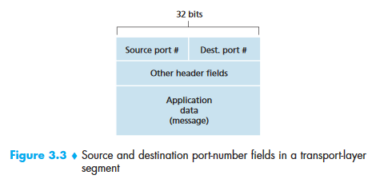


One subtle difference between a TCP socket and a UDP socket is that a TCP socket is identified by a four-tuple: (source IP address, source port number, destination IP address, destination port number), whereas UDP socket is identified by a two-tuple (destination IP address, destination port number).


## UDP

With UDP there is no handshaking between sending and receiving transport-layer entities before sending a segment. For this reason, UDP is said to be _connectionless_.

DNS uses UDP.

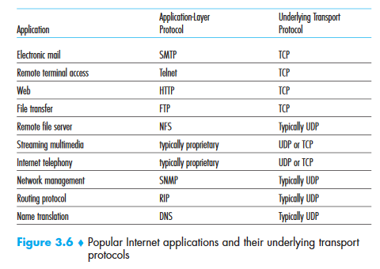


## UDP Segment Structure

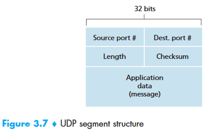


 The length field specifies the number of bytes in the UDP segment (header plus data).


## UDP Checksum

UDP at the sender side performs the 1s complement of the sum of all the 16-bit

words in the segment, with any overflow encountered during the sum being wrapped around. 

 As an example, suppose that we have the following three 16-bit words:

0110011001100000

0101010101010101

1000111100001100

The sum of first two of these 16-bit words is

0110011001100000

0101010101010101

Result:

1011101110110101

Adding the third word to the above sum gives

1011101110110101

1000111100001100

Result:

0100101011000010

Note that this last addition had overflow, which was wrapped around. The 1s complement is obtained by converting all the 0s to 1s and converting all the 1s to 0s. Thus the 1s complement of the sum 0100101011000010 is 1011010100111101,which becomes the checksum. At the receiver, all four 16-bit words are added,including the checksum. If no errors are introduced into the packet, then clearly thesum at the receiver will be 1111111111111111. If one of the bits is a 0, then we know that errors have been introduced into the packet.

_What is meant by all 16-bit word segments? => UDP header contents._


## Principles of Reliable Data Transfer

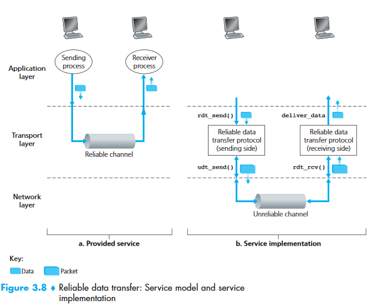


_Study from Kurose & Ross, E6: P204-230_


## TCP


### TCP Connection


*   TCP Connections provides a **full-duplex service.**
*   A TCP connection is also always point-to-point, that is, between a single sender and a single receiver. So-called “multicasting”—the transfer of data from one sender to many receivers in a single send operation—is not possible with TCP. With TCP, two hosts are company and three are a crowd!


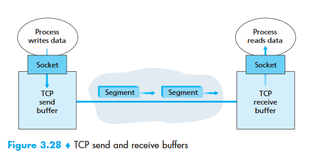


Once a TCP connection is established, the two application processes can send data to each other. Let’s consider the sending of data from the client process to the server process. The client process passes a stream of data through the socket (the door of the process). Once the data passes through the door, the data is in the hands of TCP running in the client. As shown in Figure 3.28, TCP directs this data to the connection’s **send buffer**, _which is one of the buffers that is set aside during the initial three-way handshake_. _From time to time, TCP will grab chunks of data from the send buffer and pass the data to the network layer_. Interestingly, the TCP specification [RFC 793] is very laid back about specifying when TCP should actually send buffered data, stating that TCP should “send that data in segments at its own convenience.” The maximum amount of data that can be grabbed and placed in a segment is limited by the **maximum segment size (MSS)**. The MSS is typically set by first determining the length of the largest link-layer frame that can be sent by the local sending host (the so-called **maximum transmission unit, MTU**), and then setting the MSS to ensure that a TCP segment (when encapsulated in an IP datagram) plus the TCP/IP header length (typically 40 bytes) will fit into a single link-layer frame. Both Ethernet and PPP link-layer protocols have an MSS of 1,500 bytes. Approaches have also been proposed for discovering the path MTU—the largest link-layer frame that can be sent on all links from source to destination [RFC 1191]—and setting the MSS based on the path MTU value. Note that the MSS is the maximum amount of application-layer data in the segment, not the maximum size of the TCP segment including headers. (This terminology is confusing, but we have to live with it, as it is well entrenched.)

TCP pairs each chunk of client data with a TCP header, thereby forming **TCP segments**. The segments are passed down to the network layer, where they are separately encapsulated within network-layer IP datagrams. The IP datagrams are then sent into the network. When TCP receives a segment at the other end, the segment’s data is placed in the TCP connection’s receive buffer, as shown in Figure 3.28. The application reads the stream of data from this buffer. Each side of the connection has its own send buffer and its own receive buffer. (You can see the online flow-control applet at [http://www.awl.com/kurose-ross](http://www.awl.com/kurose-ross) , which provides an animation of the send and receive buffers.) 

We see from this discussion that a TCP connection consists of <span style="text-decoration:underline;">buffers, variables, and a socket connection to a process</span> in one host, and another <span style="text-decoration:underline;">set of buffers, variables, and a socket connection to a process</span> in another host. As mentioned earlier, no buffers or variables are allocated to the connection in the network elements (routers, switches, and repeaters) between the hosts.


## TCP Segment Structure

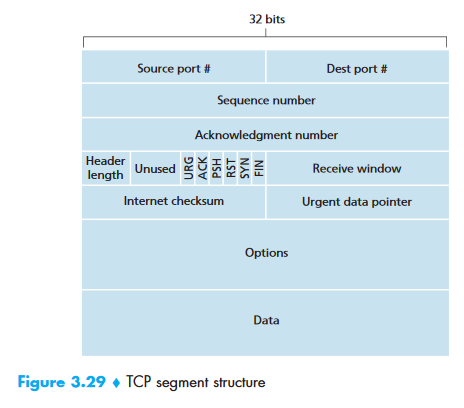


*   **Source and destination port number**: Used for multiplexing/demultiplexing
*   The 32-bit **sequence number field** and the 32-bit **acknowledgment number** field are used by the TCP sender and receiver in implementing a reliable data transfer service
*   The 16-bit **receive window field** is used for flow control.
*   The 4-bit **header length field** specifies the length of the TCP header in 32-bit words. The TCP header can be of variable length due to the TCP options field. (Typically, the options field is empty, so that the length of the typical TCP header is 20 bytes.)
*   The optional and variable-length **options field** is used when a sender and receiver negotiate the maximum segment size (MSS) or as a window scaling factor for use in high-speed networks. A time-stamping option is also defined. See RFC 854 and RFC 1323 for additional details.
*   The **flag field** contains 6 bits.
    *   _The **ACK** bit is used to indicate that the value carried in the acknowledgment field is valid; that is, the segment contains an acknowledgment for a segment that has been successfully received._
    *   _The **RST**, **SYN**, and **FIN** bits are used for connection setup and teardown._
    *   _Setting the **PSH** bit indicates that the receiver should pass the data to the upper layer immediately_.
    *   _Finally, the **URG** bit is used to indicate that there is data in this segment that the sending-side upper-layer entity has marked as “urgent.”_ _The location of the last byte of this urgent data is indicated by the 16-bit urgent data pointer field. TCP must inform the receiving-side upper-layer entity when urgent data exists and pass it a pointer to the end of the urgent data. (In practice, the PSH, URG, and the urgent data pointer are not used.)_


### Sequence Numbers and Acknowledgement Numbers

**Sequence Numbers**

TCP views data as an unstructured, but ordered, stream of bytes.

The sequence number for a segment is therefore the byte-stream number of the first byte in the segment.

Suppose that a process in Host A wants to send a stream of data to a process in Host B over a TCP connection. The TCP in Host A will implicitly number each byte in the data stream. Suppose that the data stream consists of a file consisting of 500,000 bytes, that the MSS is 1,000 bytes, and that the first byte of the data stream is numbered 0. As shown in Figure 3.30, TCP constructs 500 segments out of the data stream. The first segment gets assigned sequence number 0, the second segment gets assigned sequence number 1,000, the third segment gets assigned sequence number 2,000, and so on. Each sequence number is inserted in the sequence number field in the header of the appropriate TCP segment.

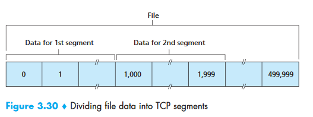


**Acknowledgement Numbers**

TCP is full-duplex, so that Host A may be receiving data from Host B while it sends data to Host B (as part of the same TCP connection). Each of the segments that arrive from Host B has a sequence number for the data flowing from B to A. _The acknowledgment number that Host A puts in its segment is the sequence number of the next byte Host A is expecting from Host B_. It is good to look at a few examples to understand what is going on here. Suppose that Host A has received all bytes numbered 0 through 535 from B and suppose that it is about to send a segment to Host B. Host A is waiting for byte 536 and all the subsequent bytes in Host B’s data stream. So Host A puts 536 in the acknowledgment number field of the segment it sends to B.

As another example, suppose that Host A has received one segment from Host B containing bytes 0 through 535 and another segment containing bytes 900 through 1,000. For some reason Host A has not yet received bytes 536 through 899. In this example, Host A is still waiting for byte 536 (and beyond) in order to re-create B’s data stream. Thus, A’s next segment to B will contain 536 in the acknowledgment number field. _Because TCP only acknowledges bytes up to the first missing byte in the stream_, TCP is said to provide **cumulative acknowledgments**.

In Figure 3.30, we assumed that the initial sequence number was zero. In truth, both sides of a TCP connection_ randomly choose an initial sequence number_. This is done to minimize the possibility that a segment that is still present in the network from an earlier, already-terminated connection between two hosts is mistaken for a valid segment in a later connection between these same two hosts (which also happen to be using the same port numbers as the old connection).

Note that, the sequence number must have some data, even though it is not required.


## Round-Trip Time Estimation and Timeout

The sample RTT, denoted `SampleRTT`, for a segment is _the amount of time between when the segment is sent (that is, passed to IP) and when an acknowledgment for the segment is received_. Instead of measuring a SampleRTT for every transmitted segment, most TCP implementations take only one SampleRTT measurement at a time. That is, at any point in time, the `SampleRTT` is being estimated for only one of the transmitted but currently unacknowledged segments, leading to a new value of `SampleRTT` approximately once every RTT. Also, TCP never computes a `SampleRTT` for a segment that has been retransmitted; it only measures `SampleRTT` for segments that have been transmitted once.

Obviously, the `SampleRTT` values will fluctuate from segment to segment due to congestion in the routers and to the varying load on the end systems. Because of this fluctuation, any given `SampleRTT` value may be atypical. In order to estimate a typical RTT, it is therefore natural to take some sort of average of the `SampleRTT` values. TCP maintains an average, called `EstimatedRTT`, of the `SampleRTT` values. Upon obtaining a new `SampleRTT`, TCP updates `EstimatedRTT` according to the following formula:


```
EstimatedRTT = (1 – alpha) • EstimatedRTT +  alpha • SampleRTT 
```


Recommended value of alpha is 0.125.


```
EstimatedRTT = 0.875 • EstimatedRTT +  0.125 • SampleRTT
```


This kind of average is called  **exponential weighted moving average (EWMA).**

DevRTT measures how much `SampleRTT `deviates from the `EstimatedRTT`.


```
DevRTT = (1 – β) • DevRTT + β•| SampleRTT – EstimatedRTT |


```


Note that DevRTT is an EWMA of the difference between SampleRTT and EstimatedRTT. If the SampleRTT values have little fluctuation, then DevRTT will be small; on the other hand, if there is a lot of fluctuation, DevRTT will be large. The recommended value of β is 0.25.


```
TimeoutInterval = EstimatedRTT + 4 • DevRTT 
```


Initial recommended value of `TimeOutInterval `is 1 second. Also, when a timeout occurs, the value of `TimeoutInterval `is doubled to avoid a premature timeout occurring for a subsequent segment that will soon be acknowledged. However, as soon as a segment is received and `EstimatedRTT `is updated, the `TimeoutInterval `is again computed using the formula above.


## Reliable Data Transfer


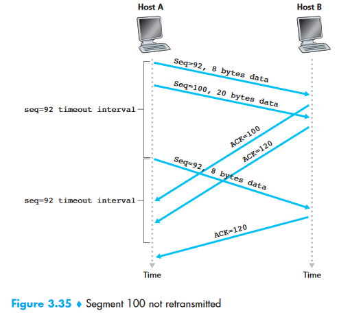

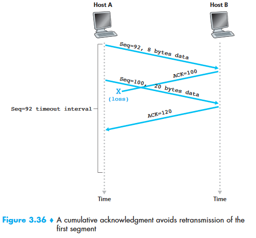

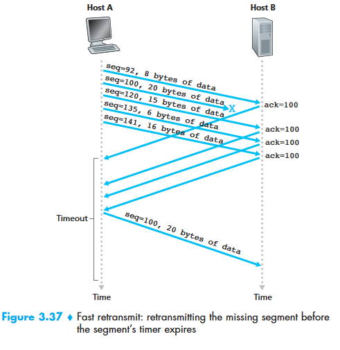


## Flow Control

_Following content is taken from: [https://hpbn.co/building-blocks-of-tcp/](https://hpbn.co/building-blocks-of-tcp/)_

Flow control is a mechanism to prevent the sender from overwhelming the receiver with data it may not be able to process — the receiver may be busy, under heavy load, or may only be willing to allocate a fixed amount of buffer space. To address this, each side of the TCP connection advertises its own `receive window (rwnd)`, which communicates the size of the available buffer space to hold the incoming data.

When the connection is first established, both sides initiate their _rwnd _values by using their system default settings. A typical web page will stream the majority of the data from the server to the client, making the client’s window the likely bottleneck. However, if a client is streaming large amounts of data to the server, such as in the case of an image or a video upload, then the server receive window may become the limiting factor.

If, for any reason, one of the sides is not able to keep up, then it can advertise a smaller window to the sender. If the window reaches zero, then it is treated as a signal that no more data should be sent until the existing data in the buffer has been cleared by the application layer. This workflow continues throughout the lifetime of every TCP connection: each ACK packet carries the latest `rwnd` value for each side, allowing both sides to dynamically adjust the data flow rate to the capacity and processing speed of the sender and receiver.


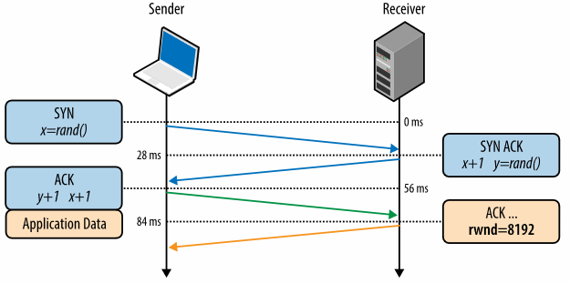


There is one minor technical problem with this scheme. To see this, suppose Host B’s (Receiver) receive buffer becomes full so that `rwnd` = 0. After advertising `rwnd `= 0 to Host A (Sender), also suppose that B has nothing to send to A. Now consider what happens. As the application process at B empties the buffer, TCP does not send new segments with new rwnd values to Host A; indeed, TCP sends a segment to Host A only if it has data to send or if it has an acknowledgment to send. Therefore, Host A is never informed that some space has opened up in Host B’s receive buffer—Host A is blocked and can transmit no more data! To solve this problem, the TCP specification requires Host A to continue to send segments with one data byte when B’s receive window is zero. These segments will be acknowledged by the receiver. Eventually the buffer will begin to empty and the acknowledgments will contain a nonzero rwnd value.


## TCP Connection Management


Suppose a process running in one host (client) wants to initiate a connection with another process in another host (server). The client application process first informs the client TCP that it wants to establish a connection to a process in the server. The TCP in the client then proceeds to establish a TCP connection with the TCP in the server in the following manner:

_Step 1_:

The client-side TCP first sends a special TCP segment to the server-side TCP. This special segment contains no application-layer data. But one of the flag bits in the segment’s header (see Figure 3.29), the SYN bit, is set to 1. For this reason, this special segment is referred to as a **SYN segment**. In addition, the client randomly chooses an initial sequence number (`client_isn`) and puts this number in the sequence number field of the initial TCP SYN segment. This segment is encapsulated within an IP datagram and sent to the server. There has

been considerable interest in properly randomizing the choice of the `client_isn `in order to avoid certain security attacks [CERT 2001–09].

_Step 2:_

Once the IP datagram containing the TCP SYN segment arrives at the server host (assuming it does arrive!), the server extracts the TCP SYN segment from the datagram, allocates the TCP buffers and variables to the connection, and sends a connection-granted segment to the client TCP. (_We’ll see in Chapter 8 that the allocation of these buffers and variables before completing the third step of the three-way handshake makes TCP vulnerable to a denial-of-service attack known as SYN flooding._) This connection-granted segment also contains no application layer data. However, it does contain three important pieces of information in the segment header. First, the SYN bit is set to 1. Second, the acknowledgment field of the TCP segment header is set to `client_isn+1`. Finally, the server chooses its own initial sequence number (`server_isn`) and puts this value in the sequence number field of the TCP segment header. This connection-granted segment is saying, in effect, “I received your SYN packet to start a connection with your initial sequence number, client_isn. I agree to establish this connection. My own initial sequence number is server_isn.” The connection granted segment is referred to as a **SYNACK segment**.

_Step 3:_

Upon receiving the SYNACK segment, the client also allocates buffers and variables to the connection. The client host then sends the server yet another segment; this last segment acknowledges the server’s connection-granted segment (the client does so by putting the value server_isn+1 in the acknowledgment field of the TCP segment header). The SYN bit is set to zero, since the connection is established. This third stage of the three-way handshake may carry client-to-server data in the segment payload.

Once these three steps have been completed, the client and server hosts can send segments containing data to each other. In each of these future segments, the SYN bit will be set to zero. Note that in order to establish the connection, three packets are sent between the two hosts, as illustrated in Figure 3.39. For this reason, this connection establishment procedure is often referred to as a** three-way handshake**.


## Principles of Congestion Control


### The Causes and Cost of Congestion

_Kurose & Ross, E6: Page 259-265_


### Approaches to Congestion Control

_End-to-end Congestion Control_: The network layer provides _no explicit support_ to transport layer for congestion-control purposes. TCP uses this, since underlying IP does not provide any feedback.

_Network-assisted Congestion Control:_ Network-layer components (that is, routers) provide explicit feedback regarding congestion state in the network to the sender.

P294


## TCP Congestion Control

`cwnd `= congestion window


```
LastByteSent – LastByteAcked <=  min{cwnd, rwnd} 
```


### Slow Start

TODO

## Recap Before Interview

**TCP Header:**

**	**


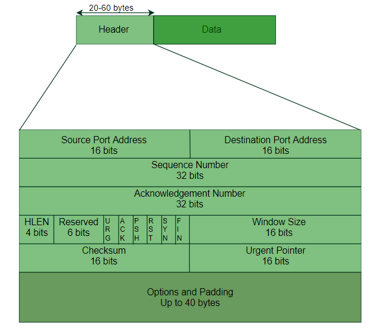


Congestion:

Heavy traffic that it slows down the network response time.

Effects of Congestion


*   As delay increases, performance decreases.
*   If the delay increases, retransmission occurs, making the situation worse.

**Congestion control algorithms**

Leaky Bucket Algorithm


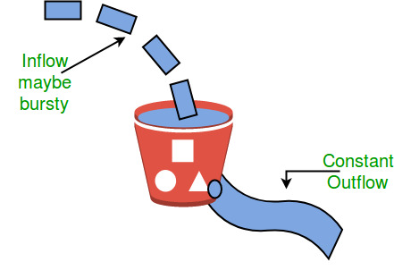


Token Bucket

A different but equivalent formulation is to imagine a network as a bucket that
is being filled. The tap is running at a rate of R, and the bucket has a capacity
of B. To send a packet, we must be able to take out tokens/water from the bucket.

```text

				        Tap

				        | | |
				        | | |       Rate R
				        | | |

			         |		        |   Capacity B
Take out water/tokens|   Bucket	    |
                     |		        |
                     |______________|	
```

### TCP Congestion Policy

1. Slow Start Phase: starts slowly increment is exponential to threshold
2. Congestion Avoidance Phase: After reaching the threshold increment is by 1
3. Congestion Detection Phase: Sender goes back to Slow start phase or Congestion avoidance phase.


### [TCP 3-Way Handshake Process](https://www.geeksforgeeks.org/computer-network-tcp-3-way-handshake-process/)


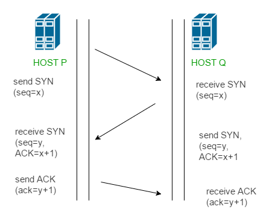


**Step 1 (SYN)** : In the first step, client wants to establish a connection with the server, so it sends a segment with SYN (Synchronize Sequence Number) which informs server that client is likely to start communication and with what sequence number it starts segments with

**Step 2 (SYN + ACK)**: Server responds to the client request with SYN-ACK signal bits set. Acknowledgement(ACK) signifies the response of segment it received and SYN signifies with what sequence number it is likely to start the segments with

**Step 3 (ACK)** : In the final part client acknowledges the response of server and they both establish a reliable connection with which they will start eh actual data transfer.


# Network Layer

_Kurose & Ross, E6: P305-413_


## Forwarding and Routing

Forwarding involves the transfer of a packet from an incoming link to an outgoing link within a single router.

Routing involves all of a network’s routers, whose collective interactions via routing protocols determine the paths that packets take on their trips from source to destination node.


## Recap Before Interview

Routing of packets from source to destination.

**IPv4**

**IPv6**

**ICMP (Internet Control Message Protocol)**

IP doesn’t provide a mechanism for sending error and control message. It depends on the Internet Control Message Protocol (ICMP) to provide an error control.

	Source quench message

	Parameter problem

	Time exceeded message

	Destination unreachable

**[Open shortest path first (OSPF)](https://www.geeksforgeeks.org/open-shortest-path-first-ospf-router-roles-configuration/)**: Open shortest path first (OSPF) is a link-state routing protocol which is used to find the best path between the source and the destination router using its own SPF algorithm.

Designated Router(DR) and Backup Designated Router(BDR) election takes place in the broadcast network or multi-access network.

**Criteria for the election:**


1. The Router having the highest router priority will be declared as DR.
2. If there is a tie in router priority then the highest router will be considered. First, the highest loopback address is considered. If no loopback is configured then the highest active IP address on the interface of the router is considered.

**[Routing Information Protocol(RIP)](https://www.geeksforgeeks.org/computer-network-routing-information-protocol-rip/)**: is a dynamic routing protocol which uses hop count as a routing metric to find the best path between the source and the destination network. It is a distance vector routing protocol which has Administrative distance (AD) value 120 and works on the application layer of the OSI model. RIP uses port number 520.

**Hop Count **:


1. Hop count is the number of routers occurring in between the source and destination network. The path with the lowest hop count is considered as the best route to reach a network and therefore placed in the routing table.
2. The maximum hop count allowed for RIP is 15 and hop count of 16 is considered as network unreachable.


# Data Link Layer

The main task of the data link layer is to transform a raw transmission facility into a line that appears to be having no errors. This task is accomplished by dividing the transmission into data frames.


# Physical Layer

Transmitting raw bits (0 or 1) over the communication channel:

_Layer topology_

*   Mesh
*   Bus
*   Ring
*   Star

_Transmission Modes_

*   Simplex
*   Half-duplex
*   Full-duplex


# Structure of Units of Different Layers [TODO]


# What happens when google.com is typed into browser?

[https://github.com/alex/what-happens-when](https://github.com/alex/what-happens-when) 


# Others

**Ports**: In computer networking,
a **port** is a communication endpoint. Physical as well as wireless connections
are terminated at ports of hardware devices. At the software level, within an
operating system, a port is a logical construct that identifies a specific process
or a type of network service. Ports are identified for each protocol and address
combination by 16-bit unsigned numbers, commonly known as the **port number**.
The most common protocols that use port numbers are the Transmission Control
Protocol (TCP) and the User Datagram Protocol (UDP).


# Credits

Part of the note is taken from the Kurose & Ross, E6 book, geeksforgeeks website,
and hpbn.co website.
